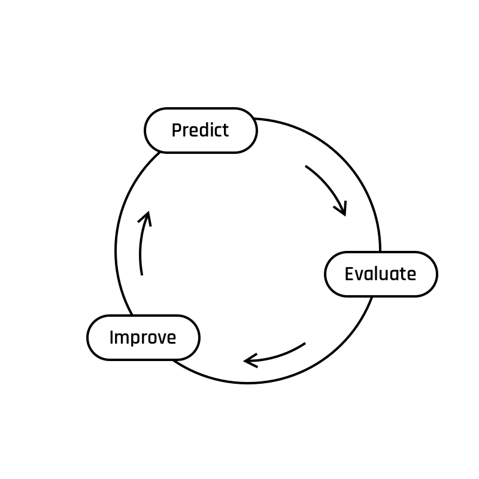

# Interlude - Predict, Evaluate, Improve

```python
'''
'A computer program is said to learn from experience E with respect to some class of tasks T and performance measure P, if its performance at tasks in T, as measured by P, improves with experience E.' 
                            - Tom Mitchell, Machine Learning, 1997
'''
```

To be said to learn you have to improve.  
To improve you have to evaluate your performance.  
To evaluate your performance you need to start performing on the task you want to be good at.  
  

One of the most common tasks in Machine Learning is **prediction**.  
This will be your algorithm's task.
This will be your task.  

{width=300px}
