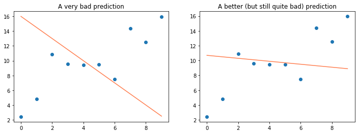
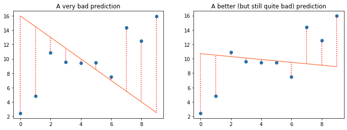

# Evaluate

## Introducing the cost function

How good is our model ?  
It is hard to say just by looking at the plot. We can clearly observe that some regression lines seem to fit our data better than others, but it is not enough. 

To evaluate our model, we are going to use a **metric**, called a **cost function** (sometimes called **loss function**). The cost function tells us how bad our model is, how much it *costs* us to use it, how much information we *lose* when we use it.  
If the model is good, we won't lose that much, if it's terrible it will cost us a lot!    

The metric you choose will deeply impact the evaluation (and therefore also the training) of your model.   

A usual way to evaluate the performance of a regression model is to measure the distance between each predicted value ($\hat{y}^{(i)}$) and the true value it tries to predict (${y}^{(i)}$) and average the sum of distances found on all examples.  
The smaller, the better! 

