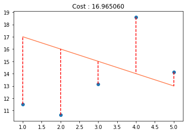
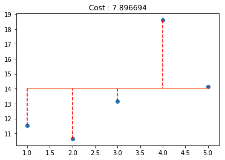
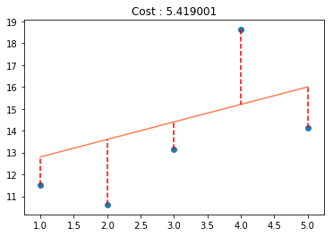

# Exercise 09 - Lets Make Nice Plots Again

|                         |                    |
| -----------------------:| ------------------ |
|   Turn-in directory :   |  ex09              |
|   Files to turn in :    |  plot.py           |
|   Forbidden functions : |  None              |
|   Remarks :             |  Matplotlib is your friend |


**It's plot time again!**

## Objective:
You must implement a function which plots the data, the prediction line, and the cost.  
You will plot the $x$ and $y$ coordinates of all data points as well as the prediction line generated by your theta parameters.
Your function must also display the overall cost ($J$) in the title, and draw small lines marking the distance between each data point and its predicted value.


## Instructions:
In the plot.py file create the following function as per the instructions given below:
```python
def plot_with_cost(x, y, theta):
    """Plot the data and prediction line from three non-empty numpy.ndarray.
    Args:
      x: has to be an numpy.ndarray, a vector of dimension m * 1.
      y: has to be an numpy.ndarray, a vector of dimension m * 1.
      theta: has to be an numpy.ndarray, a vector of dimension 2 * 1.
    Returns:
        Nothing.
    Raises:
      This function should not raise any Exception.
    """
```
\newpage

## Examples:
```python
import numpy as np
x = np.arange(1,6)
y = np.array([11.52434424, 10.62589482, 13.14755699, 18.60682298, 14.14329568])

#Example 1:
theta1= np.array([18,-1])
plot_with_cost(x, y, theta1)
# Output:
```
{width=400px}

```python
#Example 2:
theta2 = np.array([14, 0])
plot_with_cost(x, y, theta2)
# Output:
```
{width=400px}

\newpage

```python
#Example 3:
theta3 = np.array([12, 0.8])
plot_with_cost(x, y, theta3)
# Output:
```
{width=400px}
