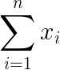

# Exercise 00 - Sum

|                         |                    |
| -----------------------:| ------------------ |
|   Turnin directory :    |  ex00              |
|   Files to turn in :    |  *sum.py           |
|   Forbidden function :  |  None              |
|   Remarks :             |  n/a               |




```python
print("Code example")
```
