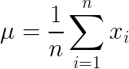

# Exercise 01 - Mean

|                         |                    |
| -----------------------:| ------------------ |
|   Turnin directory :    |  ex00              |
|   Files to turn in :    |  mean.py           |
|   Forbidden function :  |  None              |
|   Remarks :             |  n/a               |

You must implement the following formula as a function:  
  


Create a function called `mean` which takes an array as argument and returns its mean, using a foor loop.

```python
>>> X = [0, 15, -9, 7, 12, 3, -21]
>>> mean(X)
1.0
```

