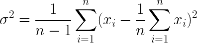
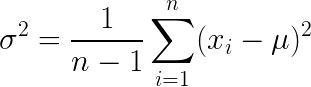

# Exercise 02 - Variance
|                         |                    |
| -----------------------:| ------------------ |
|   Turnin directory :    |  ex00              |
|   Files to turn in :    |  variance.py       |
|   Forbidden function :  |  *.sum(), np.var() |
|   Remarks :             |  n/a               |

You must implement the following formula as a function:  
  


If you look carefully you will discover that this messy formula can be expressed as terms you have previously implemented. 



Create a function called `variance` which takes an array as argument and returns its variance, using a foor loop.

```python
>>> X = [0, 15, -9, 7, 12, 3, -21]
>>> variance(X)
134.57142857142858
```

