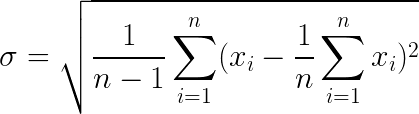
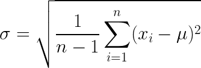
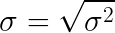

# Exercise 03 - Standard Deviation
|                         |                    |
| -----------------------:| ------------------ |
|   Turnin directory :    |  ex03              |
|   Files to turn in :    |  std.py            |
|   Forbidden function :  |  *.sum(), np.var() |
|   Remarks :             |  n/a               |

You must implement the following formula as a function:  
  


As before, this formula is not as tough as it seems...  
It can be reduced to something already known.
  
  

Seems familiar?   
  
...  



Create a function called `std` which takes an array as argument and returns its standard deviation, using a foor loop.

```python
>>> X = [0, 15, -9, 7, 12, 3, -21]
>>> std(X)
11.600492600378166
```

