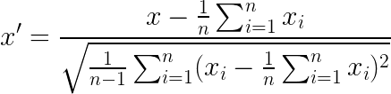
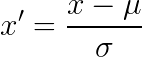

# Exercise 04 - Z-score standardization

|                         |                    |
| -----------------------:| ------------------ |
|   Turnin directory :    |  ex00              |
|   Files to turn in :    |  *sum.py           |
|   Forbidden function :  |  *.sum(), np.var() |
|   Remarks :             |  n/a               |

You must implement the following formula as a function: 
  




Create a function called `zscore` which takes an array as argument and returns a lambda function of the z-score standardization for that array.

```python
>>> X = [0, 15, -9, 7, 12, 3, -21]
>>> z = zscore(X)
>>> z(15)
1.2068453023747985
>>> z(-21)
-1.896471189446112
>>> z(0)
-0.08620323588391418
```
