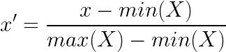

# Exercise 05 - min-max standardization

|                         |                    |
| -----------------------:| ------------------ |
|   Turnin directory :    |  ex05              |
|   Files to turn in :    |  minmax.py         |
|   Forbidden function :  |  *.sum(), np.var() |
|   Remarks :             |  n/a               |

You must implement the following formula as a function: 
  


Where min(X) is the minimum value of the vector X, and max(X) its maximum value.

Create a function called `minmax` which takes an array as argument and returns a lambda function of the min-max standardization for that array.

```python
>>> X = [0, 15, -9, 7, 12, 3, -21]
>>> m = minmax(X)
>>> m(15)
1.0
>>> m(-21)
0.0
>>> m(0)
0.5833333333333334
```
