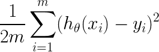

# Exercise 06 - Mean Squared Error

|                         |                    |
| -----------------------:| ------------------ |
|   Turnin directory :    |  ex06              |
|   Files to turn in :    |  mse.py            |
|   Forbidden function :  |  *.sum()           |
|   Remarks :             |  n/a               |

You must implement the following formula as a function:  
  


Create a function called `mse` which takes three arguments : 
  - an array which correspond to the vector x in the previous formula,
  - an array which correspond to the vector y in the previous formula,
  - a function to be applied element-wise to the vector X, corresponding to the 

Your function must returns a double.

```python
>>> X = [0, 15, -9, 7, 12, 3, -21]
>>> sum(X)
7
```

