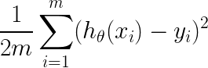
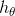

# Exercise 06 - Mean Squared Error

|                         |                    |
| -----------------------:| ------------------ |
|   Turnin directory :    |  ex06              |
|   Files to turn in :    |  mse.py            |
|   Forbidden function :  |  *.sum()           |
|   Remarks :             |  n/a               |

You must implement the following formula as a function:  
  


Where x and y are vectors of lenght m, and  is a function.

Create a function called `mse` which takes three arguments : 
  - an array which correspond to the vector x in the previous formula,
  - an array which correspond to the vector y in the previous formula,
  - a function to be applied element-wise to the vector X, corresponding to 

Your function must use a for loop and returns a double.

```python
>>> X = [0, 15, -9, 7, 12, 3, -21]
>>> Y = [2, 14, -13, 5, 12, 4, -19]
>>> h = lambda x : x * 0.8
>>> mse(X, Y, h)
3.939999999999999
>>> mse(X, X, h)
2.71142857142857
```

