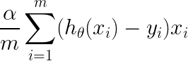
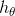

# Exercise 07 - Gradient

|                         |                    |
| -----------------------:| ------------------ |
|   Turnin directory :    |  ex07              |
|   Files to turn in :    |  gradient.py       |
|   Forbidden function :  |  *.sum()           |
|   Remarks :             |  n/a               |

You must implement the following formula as a function:  
  


Where x and y are vectors of lenght m, and  is a function.

Create a function called `mse` which takes four arguments : 
  - an array which correspond to the vector x in the previous formula,
  - an array which correspond to the vector y in the previous formula,
  - a function to be applied element-wise to the vector X, corresponding to 
  - a double corresponding to 
  
Your function must use a for loop and returns a double.

```python
>>> X = [0, 15, -9, 7, 12, 3, -21]
>>> Y = [2, 14, -13, 5, 12, 4, -19]
>>> h = lambda x : x * 0.8
>>> gradient(X, Y, h, 1)
-11.271428571428569
>>> gradient(X, Y, h, 0.1)
-1.127142857142857
>>> gradient(X, X, lambda x: x, 0.5)
0.0
```

