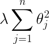
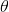

# Exercise 08 - Ridge Regression

|                         |                    |
| -----------------------:| ------------------ |
|   Turnin directory :    |  ex08              |
|   Files to turn in :    |  *sum.py           |
|   Forbidden function :  |  *.sum()           |
|   Remarks :             |  n/a               |

You must implement the following formula as a function:  
  


Where  is a vector of length n.

Create a function called `ridge` which takes an array and a double as argument and returns the sum of all of its elements squared times lambda, using a foor loop.

```python
>>> X = [0, 15, -9, 7, 12, 3, -21]
>>> ridge(X, 0.5)
474.5
```

