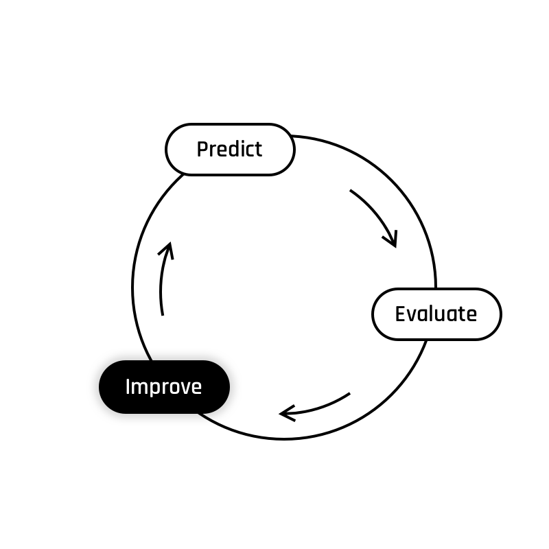

### Improve

  

Yesterday, you saw the first two steps of the learning process: start with a prediction and evaluate it. Now we are going to learn the third part: how to improve it!  

Given our measure of performance, improvement implies **reducing the loss (or cost)** measured by our cost function. If we plot the cost of our prediction given $\theta_1$ we obtain a curve like this one: 

[IMG cost func]

On the graph above, we can see that some values of $\theta_1$ generate awful predictions, while others are way better at predicting the value of $y$.

[IMG BAD / VS GOOD]

Knowing that fact, we can expect to find one specific value of $\theta_1$ for which the resulting cost is minimal. This value is at the bottom of our graph. 

Therefore, given any value of $\theta_1$, improving our prediction means getting closer to the minimum of the cost function (the bottom of the curve). In other words: if we change the value of $\theta_1$ in order to move closer to that minimum, our prediction will be better.  

#### But, how to get closer to the minimum?

Excellent question dear reader. I am glad you asked!  
The first step is to find the direction in which you want to go. Typically, we get that information with the __*slope*__ of the curve.  
This can be done by calculating the derivative of our cost function. 

The story gets a little more complicated, however, since we have two parameters to adjust: $\theta_0$ and $\theta_1$. Not just $\theta_1$. Therefore we need to calculate separate __*partial derivatives*__ of our cost function for each theta parameter, and package them in a vector, which is called __*gradient*__ (noted $\nabla$).
