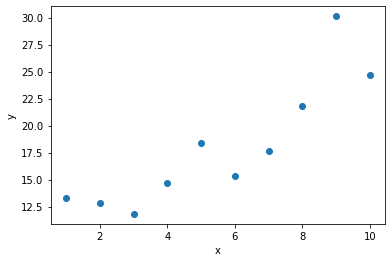
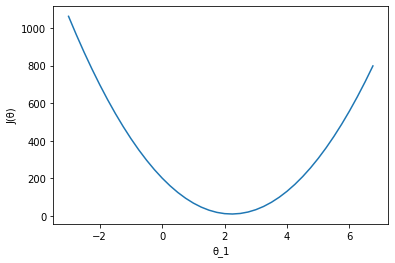
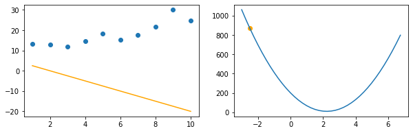
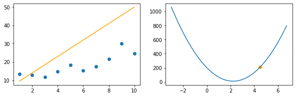
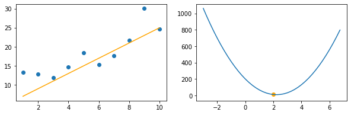

# Interlude - Improve

{width=400px}  

Yesterday, you discovered the first two steps of the learning process: starting with a model that makes naive predictions and evaluating it. Now we are going to tackle the third part: improving it!  

Lets take a new dataset:  

{width=400px} 

Given our measure of performance, improvement entails **reducing the cost (or loss)** measured by the cost function. If we plot the cost of a model's predictions as a function of its $\theta_1$ parameter (with a fixed value for $\theta_0$), we obtain a curve like this one: 

{width=400px} 

On the graphs below, you can see the we can see that extreme $\theta_1$ values (which modifies the slope of the hypothesis curve - in orange) correspond to a very high cost. On the other hand, as we get closer to the bottom of the curve, the cost is reduced.  

{width=600px} 

{width=600px} 

{width=600px} 

The cost function's minimum corresponds to the bottom of the curve. We want $\theta_1$ to get to this sweet spot. It means that wherever $\theta_1$ starts at, as the training goes on, it needs to get closer to the value that matches $J(\theta)$'s minimum.

#### But how to get closer to the minimum?

Excellent question dear reader. We're glad you asked!  
First, the algorithm needs to figure out in what direction $\theta_1$ should be moved (i.e. increased or decreased). It does so by calculating the __*slope*__ of the $J(\theta)$ curve at the current position of $\theta_1$. If the slope is positive, $\theta_1$ must be decreased. If the slope is negative, it must be increased. If you have studied calculus, you probably sense that all of this involves calculating the derivative of the cost function.

The story gets a little more complicated, however, because we have two parameters to adjust: $\theta_0$ and $\theta_1$. Not just $\theta_1$ (as we showed in our example to simplify). This means the $J(\theta)$ function doesn't have one derivative, but two __*partial derivatives*__. One that computes the slope of $J$ with respect to $\theta_0$, and a second one for the slope of $J$ with respect to $\theta_1$. Finally, we package those partial derivatives in a vector of dimension $2 * 1$, which is called __*gradient*__ (noted $\nabla$).  

Don't worry if you don't master multivariate calculus yet, we have calculated the partial derivatives for you, all you will need to do is write them in Python.  