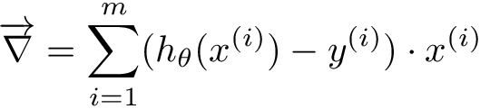

# Exercise 04 - Vectorized Logistic Gradient

|                         |                         |
| -----------------------:| ----------------------- |
|   Turnin directory :    |  ex04                   |
|   Files to turn in :    |  vec_log_grad.py        |
|   Forbidden function :  |  None                   |
|   Remarks :             |  n/a                    |

You must implement the following formula as a function:  
 
 
 
{\displaystyle {\overrightarrow {\nabla }}} = \sum_{i = 1}^{m} (h_\theta (x^{(i)}) - y^{(i)}) \cdot x^{(i)} 
 
 Where:
 {\displaystyle {\overrightarrow {\nabla }}} is the gradient
- x represent the input coefficients
- m is the lenght of y, i.e. the number of observations in our sample
- hθ(x) , also called y_hat or y_pred, is the calculated hypothesis and it represents the predicted output
- y, also called y_true, represents the desired output, either 1 or 0.

We will the gradient later to update our weights (θ) with respect to the learning rate (α).

Create a function called `vec_log_grad` which takes three arguments:
  - x : a vector or a matrix
  - y_true : a scalar value or a vector for the desired output
  - y_pred : a scalar value or a vector for the hypothesis
  
x lenght (shape[0]) should match y_true and y_pred lenght, i.e. we should have the same
number of observations.<br>
x width (shape[1]) will be 1 (for the intercept) + the number of coefficients. It should match theta lenght, but this is for later when we will update theta

```python
def vec_log_grad_(x, y_true, y_pred):
```

The function must return a scalar value or a vector of the width of x:

```python
>>> import numpy as np
>>> from vec_log_grad import vec_log_grad_
>>> from sigmoid import sigmoid_
>>> 
>>> x = np.array([1, 4.2])  # 1 represent the intercept
>>> y_true = 1
>>> theta = np.array([0.5, -0.5])
>>> y_pred = sigmoid_(x * theta)
>>> vec_log_grad_(x, y_pred, y_true)
4.11933401978
>>> 
>>> x = np.array([1, -0.5, 2.3, -1.5, 3.2])
>>> y_true = 0
>>> theta = np.array([0.5, -0.5, 1.2, -1.2, 2.3])
>>> y_pred = sigmoid_(x * theta)
>>> vec_log_grad_(x, y_true, y_pred)
4.41520709566
>>> 
>>> x_new = np.arange(2, 14).reshape((3, 4))
>>> x_new = np.insert(x_new, 0, 1, axis=1)
>>> # first column of x_new is now intercept values initiliazed to 1
>>> y_true = np.array([1, 0, 1])
>>> theta = np.array([0.5, -0.5, 1.2, -1.2, 2.3])
>>> y_pred = sigmoid_(np.dot(x_new, theta))
>>> vec_log_grad_(x_new, y_true, y_pred)
[ 0.99994451  5.99988885  6.99983336  7.99977787  8.99972238]
```
