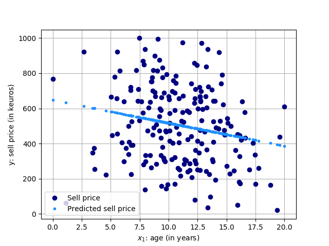
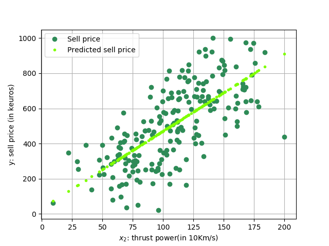
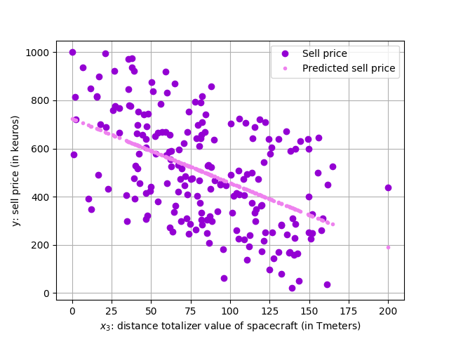
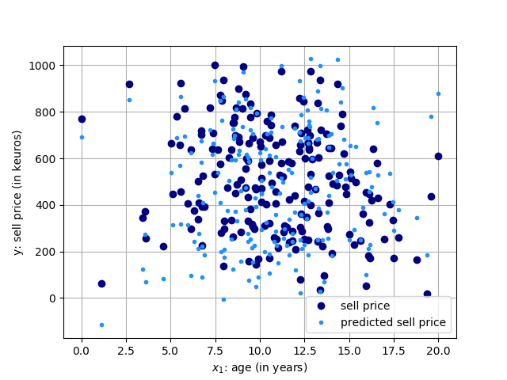
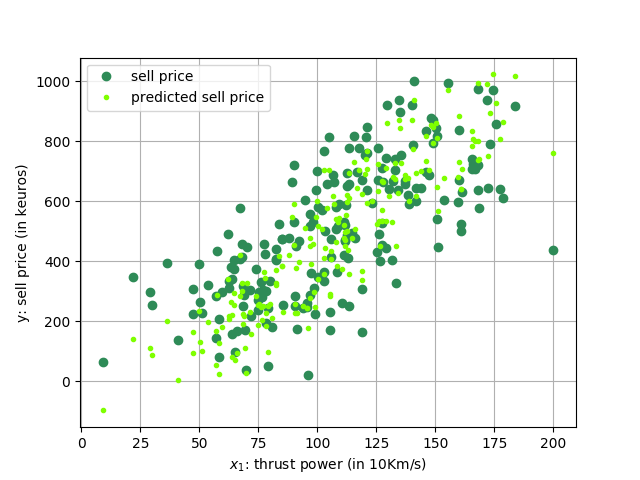
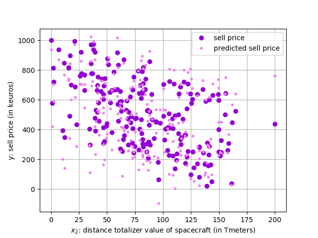

# Exercise 08 - Practicing Multivariate Linear Regression

|                         |                    |
| -----------------------:| ------------------ |
|   Turn-in directory :   |  ex08              |
|   Files to turn in :    |  multivariate\_linear\_model.py  |
|   Authorized modules :  |  numpy, matplotlib |
|   Forbidden modules :   |  sklearn           |
|   Remarks :             |  Read the doc      |

## Objectives:

* Fit a linear regression model to a dataset with multiple features.
* Plot the model's predictions and interpret the graphs. 


## Instructions:

Yesterday you performed a univariate linear regression on a dataset to make predictions based on ONE feature (well done!). Now, it's time to dream bigger. Lucky you are, we give you a new dataset with multiple features that you will find in the resources attached.  
The dataset is called `spacecraft_data.csv` and it describes a set of spacecrafts with their price, as well as a few other features. A description of the dataset is provided in the file named `spacecraft_data_description.txt`.


## Part One: Univariate Linear Regression

To start, we'll build on yesterday's work and see how a univariate model can predict spaceship prices. As you know, univariate models can only process ONE feature at a time. So to train each model, you need to select a feature and ignore the other ones.

### Instructions:

In the first part of the exercise, you will train three different univariate models to predict spaceship prices. Each model will use a different feature of the spaceships.

### 1a) Age
Select the *Age* feature as your $x$ vector, and *Sell_price* as your $y$ vector. Train a first model, `myLR_age`, and generate price predictions ($\hat{y}$).  
Output a scatter plot with both sets of data points on the same graph, as follows:
- The actual prices, given by $(x_{age}^{(i)},y^{(i)})$  for $i=0....m$ 
- The predicted prices, represented by  $(x_{age}^{(i)},\hat{y}^{(i)})$  for $i=0....m$  (see example below),

{width=400px}

### 1b) Thrust
Select the *Thrust_power* feature as your $x$ vector, and *Sell_price* as your $y$ vector. Train a second model, `myLR_thrust`, and generate price predictions ($\hat{y}$).  
Output a scatter plot with both sets of data points on the same graph, as follows:
- The actual prices, given by $(x_{thrust}^{(i)},y^{(i)})$  for $i=0....m$ 
- The predicted prices, represented by  $(x_{thrust}^{(i)},\hat{y}^{(i)})$  for $i=0....m$  (see example below),

{width=400px}

### 1c) Total distance
Select the *Terameters* feature as your $x$ vector, and *Sell_price* as your $y$ vector. Train a third model, `myLR_distance`, and make price predictions ($\hat{y}$).  
Output a scatter plot with both sets of data points on the same graph, as follows:
- The actual prices, given by $(x_{distance}^{(i)},y^{(i)})$  for $i=0....m$ 
- The predicted prices, represented by  $(x_{distance}^{(i)},\hat{y}^{(i)})$  for $i=0....m$  (see example below),

{width=400px}

### Reminder:

* After executing the `fit_` method, you may obtain  $\theta$ = array([[nan, nan]]).  
  If it happens, try reducing your learning rate.
* Be aware that you also need to set the appropriate number of cycles for the `fit_` function. If it's too low, you might not be leaving enough cycles for the gradient descent to carry out properly. Try to find a value that gets you the best score, but that doesn't make the training last forever.

### Hint:

First, try plotting the data points $(x_{j},y)$. Then you can guess initial theta values that are not too far off. This will help your algorithm converge more easily.

### Examples:

```python
import pandas as pd
import numpy as np
form mylinearregression import MyLinearRegression as MyLR

data = pd.read_csv("spacecraft_data.csv")
X = np.array(data[['Age']])
Y = np.array(data[['Sell_price']])
myLR_age = MyLR([[1000.0], [-1.0]])
myLR_age.fit_(X[:,0].reshape(-1,1), Y, alpha = 2.5e-5, n_cycle = 100000)

RMSE_age = myLR_age.mse_(X[:,0].reshape(-1,1),Y)
 print(RMSE_age)
57636.77729...
```
How accurate is your model when you only take one feature into account?

## Part Two: Multivariate Linear Regression (A New Hope)

Now, it's time for your first multivariate linear regression! Here, you will train a single model that will take all features into account.

### Instructions:

### 2a) Training the model
- Train a single multivariate linear regression model on all three features.
- Display and interpret the resulting theta parameters. What can you say about the role that each feature plays in the price prediction?
- Evaluate the model with the Mean Squared Error. How good is your model doing, compared to the other three that you trained in Part One of this exercise?

#### Remarks:

You can obtain a better fit if you increase the number of cycles.

#### Examples:

```python
import pandas as pd
import numpy as np
from mylinearregression import MyLinearRegression as MyLR

data = pd.read_csv("spacecraft_data.csv")
X = np.array(data[['Age','Thrust_power','Terameters']])
Y = np.array(data[['Sell_price']])
my_lreg = MyLR([1.0, 1.0, 1.0, 1.0])

my_lreg.mse_(X,Y)
# 144044.877...

my_lreg.fit_(X,Y, alpha = 1e-4, n_cycle = 600000)
my_lreg.theta
# array([[334.994...],[-22.535...],[5.857...],[-2.586...]])

my_lreg.mse_(X,Y)
# 586.896999...
```

### 2b) Plotting the predictions

Here we'll plot the model's predictions just like we did in Part One. We'll make three graphs, each one displaying the predictions and the actual prices as a function of ONE of the features.

* On the same graph, plot the actual and predicted prices on the $y$ axis , and the $age$ feature on the $x$ axis. (see figure below)

{width=400px}

* On the same graph, plot the actual and predicted prices on the $y$ axis , and the $thrust power$ feature on the $x$ axis. (see figure below)

{width=400px}

* On the same graph, plot the actual and predicted prices on the $y$ axis , and the $distance$ feature on the $x$ axis. (see figure below)

{width=400px}

Can you see any improvement on these three graphs, compared to the three that you obtained in Part One? Can you relate your observations to the MSE value that you just calculated?
