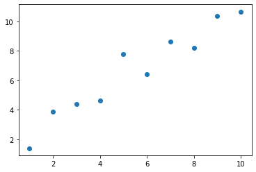
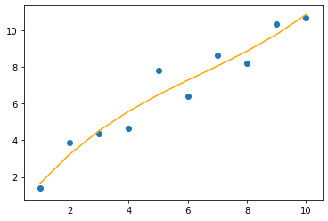

# Interlude - Plotting Curves With Matplotlib

We asked you to plot straight lines in the day00. Now you are working with polynomial models, the hypothesis functions are not straight lines, but curves.   
Plotting curves is a bit more tricky, because if you do not have enough data point, you will get an ugly broken line instead of a smooth curve.  
Here's a way to do it.  

Let's begin with a simple dataset:

```python
import numpy as np
import matplotlib.pyplot as plt

x = np.arange(1,11).reshape(-1,1)
y = np.array([[ 1.39270298],
           [ 3.88237651],
           [ 4.37726357],
           [ 4.63389049],
           [ 7.79814439],
           [ 6.41717461],
           [ 8.63429886],
           [ 8.19939795],
           [10.37567392],
           [10.68238222]])

plt.scatter(x,y)
plt.show()
```
{width=300px}

Now, we build a polynomial model of degree 3 and plot its hypothesis function $h(\theta)$.

```python
from polynomial_model import add_polynomial_features
from mylinearregression import MyLinearRegression as MyLR

# Build the model:
x_ = add_polynomial_features(x, 3)
my_lr = MyLR(np.ones(4).reshape(-1,1)).fit_(x_, y)

# Plot:
## To get a smooth curve, we need a lot of data points
continuous_x = np.arange(1,10.01, 0.01).reshape(-1,1)
x_ = add_polynomial_features(continuous_x, 3)
y_hat = my_lr.predict_(continuous_x)

plt.scatter(x,y)
plt.plot(continuous_x, y_hat, color='orange')
plt.show()
```
{width=300px}
