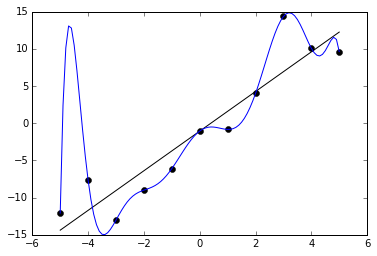
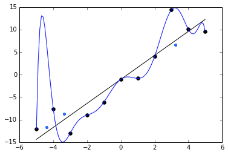

## Lost in Overfitting
The two previous exercises lead you, dear reader, to a very dangerous territory: in the realm of **overfitting**.  You did not see it coming but now, you are in a bad situation...  

By increasing the polynomial degree of your model, you increased its **complexity**.  
Is it wrong?  
Not always.  
Some models are indeed very complex because the relationships they represent are very complex as well. 

But, if you look at the plots for the previous exercise's *best model*, you should feel that something is wrong. 

### Something is rotten in the state of our model...
Take a look at the following plot. 

{width=400px}  

You can see that the prediction line fits each data point perfectly, but completely misses out on capturing the relationship between $x$ and $y$ properly.  
And now, if we add some brand new data points to the dataset, we see that the predictions on those new examples are way off. 

{width=400px}  

This situation is called overfitting, because the model is doing an excessively good job at fitting the data. It is literally bending over backward to account for the data's minute details. But most the data's irregularities are just noise, and they should actually be ignored. So because the model overfit, it can't generalize to new data.

### The training set, the test set, and the happy data scientist
To avoid overfitting, **you should always evaluate your model on new data**.  
  
New data means, data that your model hasen't seed during training. To do so, now and forever, you must always divide your dataset in (at least) two parts: one for the training, and one for the evaluation of your model. 