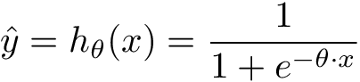

# Exercise 01 - Logistic Loss Function

|                         |                         |
| -----------------------:| ----------------------- |
|   Turnin directory :    |  ex00                   |
|   Files to turn in :    |  *log_loss.py           |
|   Forbidden function :  |  None                   |
|   Remarks :             |  n/a                    |

You must implement the following formula as a function:  
  


Cost(h_{ \theta }(x), y) = -ylog(h_{ \theta }(x)) - (1 - y)log(1 - h_{ \theta }(x))

J( \theta) = \frac{1} {m} * \lbrack \sum_{i = 1}^{m} -y^{(i)}log(h_{ \theta }(x^{(i)})) + (1 - y^{(i)})log(1 - h_{ \theta }(x^{(i)}))\rbrack

Where:  
- hθ(x) is the calculated hypothesis, also called y_hat or y_pred, it represents the predicted output (formula below)
- y, also called y_true, represents the desired output, either 1 or 0.


This function is called the Cross-Entropy loss or logistic loss.
We encourage you to get a look at
[this section](https://en.wikipedia.org/wiki/Cross_entropy#Cross-entropy_error_function_and_logistic_regression)
of the Cross entropy Wikipedia.

Formula for hypothesis:


    
\hat{y} = h_{ \theta }(x) = \frac{1} {1 + e^{-\theta \cdot x}}

Create a function called `log_loss_` which takes two arguments: 
  - a scalar value for the desired output
  - a scalar value or a vector for the hypothesis
  
Hint : to avoid log(0) errors, a common approach is to add a residual term error epsilon to our y_pred (eg: eps = 1e-15)

```python
def log_loss_(y_true, y_pred):
```

The function must return a scalar value:

```python
>>> import numpy as np
>>> from log_loss import log_loss_
>>> from sigmoid import sigmoid_
>>> x = 4
>>> y_true = 1
>>> theta = 0.5
>>> y_pred = sigmoid_(theta*x)
>>> log_loss_(y_true, y_pred)
0.12692801104297152
>>> x = np.array([-5, 0.109, 0.652, 4.897])
>>> y_true = 1
>>> theta = np.array([-1.589, 0.2579, 0.023, -5.064])
>>> y_pred = sigmoid_(theta*x)
>>> log_loss_(y_true, y_pred)
26.16357120684633
```
