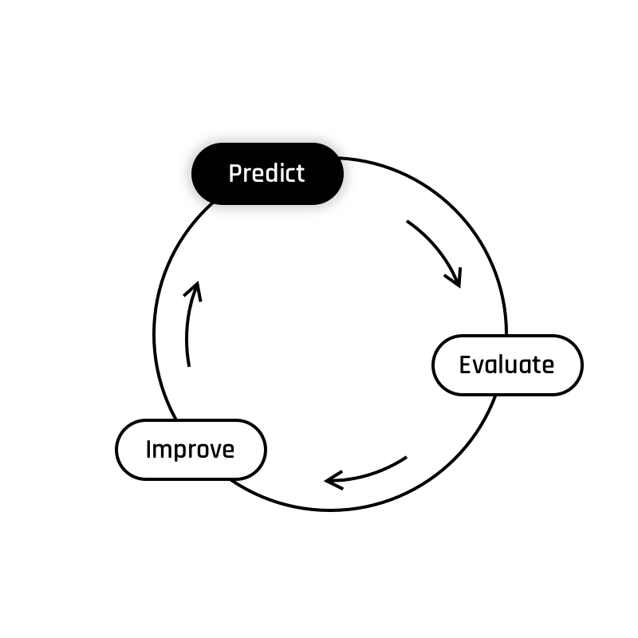

# Interlude - Predict I: Introducing the Sigmoid Function
  {width=300px}  

## Formulating a Hypothesis  
Remember that a hypothesis, denoted $h(\theta)$, is an equation that combines a set of **features** (that characterize an example) with **parameters** in order to output a **prediction**. Remember the hypothesis we used in linear regression?  

$$
h(\theta) = \theta_0 + \theta_{1} x_{1}^{(i)} + \dots + \theta_{n} x_{n}^{(i)} = \theta \cdot x'^{(i)}
$$

It worked fine to predict continuous values, but could we also use it to tell, for example, if a patient is sick or not?  
That's a yes-or-no question, so the output from the hypothesis function should reflect that.

To get started, we'll assign each class a numerical value: sick patients will be assigned a value of 1, and healthy patients will be assigned a value of 0. The goal will be to build a hypothesis that outputs a probability that a patient is sick, as a float number within the range of 0 and 1.

The good news is that we can keep the linear equation we already worked with! All we need to do is sqash its output through another function that is bounded between 0 and 1. That's the **Sigmoid function** and your next exercise is to implement it!