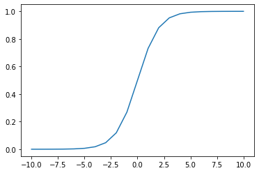

# Predict II : the hypothesis
    

If you were curious, you have plot the results of your sigmoid function from the las exercercise. If you don't, well ... here is a plot of it:

  

As you can see, **the results of the sigmoid are in the range (0,1)**.  
You can take real numbers as big as you want (positives or negatives), they will always land in this range. This will be helpfull for the next part.

# The logistic hypothesis

Now you have your sigmoid function, let's look at **the logistic regression hypothesis**.

$$
\begin{matrix}
\hat{y}^{(i)} = h_{ \theta }(x^{(i)}) = \frac{1} {1 + e^{-\theta \cdot x^{(i)}}} & &\text{ for i = 1, \dots, m}    
\end{matrix}
$$

**This is simply the sigmoid functions applied to the results of the linear regression hypothesis !!**  

As told before: the **sigmoid function** is just a way to **map the result of a linear regression into a range of values from 0 to 1**.  

By doing such transformation, we can then use the result as a **probability of being a member of a class**.

