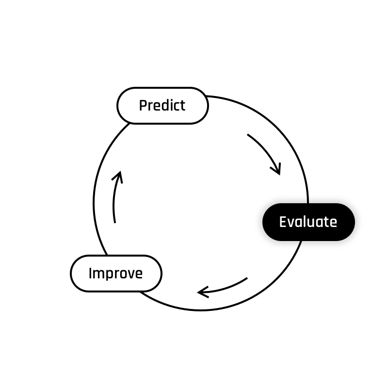
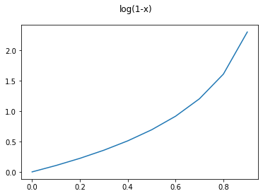
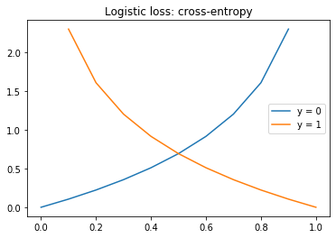

# Evaluate

    

Our **model** can **predict the probability** for a given example **to be part of the class labeled as 1**.  
Now it is time to evaluate how good it is.  

The previous cost function, used to evaluate linear regression, is not appropriate in a classification case.  

Given the fact that classification tasks imply only two possible values:
- **zero**, if the element is not a member of the predicted class,
- **one**, if the element is a member of the predicted class,  
  measuring the 'distance' between the prediction and the label is not going to be the best way to evaluate the performance of a classification  model.

For this reason, we are going to use another cost function, called the **cross-entropy**, given by the following formula:  
$$
J( \theta) = -\frac{1} {m} \lbrack \sum_{i = 1}^{m} y^{(i)}\log(\hat{y}^{(i)})) + (1 - y^{(i)})\log(1 - \hat{y}^{(i)})\rbrack
$$

This formula is simpler that it looks. It encapsulates the two possibles cases:  
#### If the given example $x^{(i)}$ is not part of the predicted class, $y^{(i)} = 0$ :  
$$
\begin{matrix}
y^{(i)} & = & 0 \\
y^{(i)}\log(\hat{y}^{(i)})) & = & 0   
\end{matrix}
$$

Therefore 
$$
J( \theta) = -\frac{1} {m} \lbrack \sum_{i = 1}^{m} \cancel{y^{(i)}\log(\hat{y}^{(i)}))} + (1 - y^{(i)})\log(1 - \hat{y}^{(i)})\rbrack
$$
$$
J( \theta) = -\frac{1} {m} \sum_{i = 1}^{m} (1 - y^{(i)})\log(1 - \hat{y}^{(i)})
$$

The function $\log(1 - x)$ looks like that: 

    

You can see from the plot that: 
- if the prediction is close to one, the cost will be great, 
- if the prediction is close to zero, the cost will be small.  

#### If the given example $x^{(i)}$ is part of the predicted class, $y^{(i)} = 1$ :  
$$
\begin{matrix}
y^{(i)} & = & 1 \\
1 - y^{(i)} & = & 0 \\ 
(1 - y^{(i)})\log(1 - \hat{y}^{(i)}) & = & 0     
\end{matrix}
$$

Therefore 
$$
J( \theta) = -\frac{1} {m} \lbrack \sum_{i = 1}^{m} y^{(i)}\log(\hat{y}^{(i)})) + \cancel{(1 - y^{(i)})\log(1 - \hat{y}^{(i)})}\rbrack
$$
$$
J( \theta) = -\frac{1} {m} \sum_{i = 1}^{m} y^{(i)}\log(\hat{y}^{(i)}))
$$

The function $\log(x)$ looks like that: 

    

You can see from the plot that: 
- if the prediction is close to zero, the cost will be great, 
- if the prediction is close to one, the cost will be small.  

Therefore, the plot of the logistic loss looks like this:   

    
