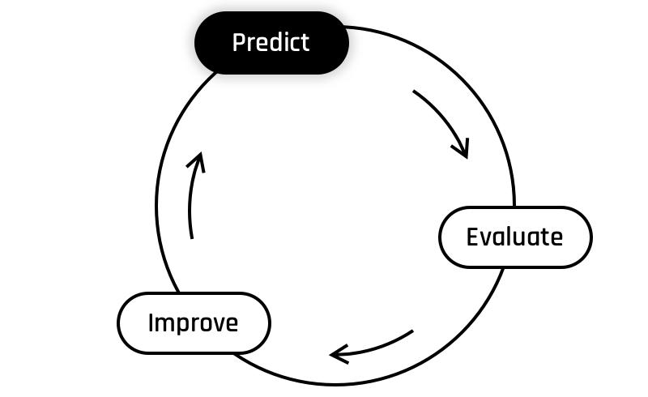

# Predict 

{width=300px}

## A very simple model

We have some data.   We want to model it.  
* First we need to *make an assumption*, or hypothesis, *about the structure of the data and the relationship between the variables*.  
* Then we can *apply that hypothesis to our data to make predictions*. 

$$
hypothesis(data) = predictions
$$

### Hypothesis
Let's start with a very simple and intuitive **hypothesis** on how the price of a spaceship can be predicted based on the power of its engines.  
We will consider that *the more powerful the engines are, the more expensive the spaceship is*.  
Furthermore, we will assume that the price increase is **proportional** to the power increase. In other words, we will look for a **linear relationship** between the two variables.

This means that we will formulate the price prediction with a **linear equation**, that you might be already familiar with :  

$$
\hat{y} = ax + b
$$

We add the '^' symbol over the $y$ to specify that $\hat{y}$ *(pronounced y-hat)* is a **prediction** (or estimation) of the real value of $y$. The prediction is calculated with the **parameters** $a$ and $b$ and the input value $x$.  

For example, if $a = 5$ and $b = 33$, then $\hat{y} = 5x + 33$.  

But in Machine Learning, we don't like using the letters $a$ and $b$. Instead we will use the following notation: 

$$
\hat{y} = \theta_0 + \theta_1 x
$$

So if $\theta_0 = 33$ and $\theta_1 = 5$, then $\hat{y} = 33+ 5x$.    

To recap, this linear equation is our **hypothesis**. Then, all we will need to do is find the right values for our parameters $\theta_0$ and $\theta_1$ and we will get a fully-functional prediction **model**. 

### Predictions
Now, how can we generate a set of predictions on an entire dataset? Let's consider a dataset containing $m$ data points (or space ships), called **examples**.  

What we do is stack the $x$ and $\hat{y}$ values of all examples in vectors of length $m$. The relation between the elements in our vectors can then be represented with the following formula:  

$$
\begin{matrix}
\hat{y}^{(i)} = \theta_0 + \theta_1 x^{(i)} & & \text{ for i = 1, ..., m}
\end{matrix}
$$  

Where:
- $\hat{y}^{(i)}$ is the $i^{th}$ component of vector $y$
- $x^{(i)}$ is the $i^{th}$ component of vector $x$   

Which can be experessed as:  

$$
\hat{y} = \begin{bmatrix}\theta_0 + \theta_1 \times x^{(1)} \\ \vdots \\  \theta_0 + \theta_1 \times x^{(m)}\ \end{bmatrix}
$$  

For example,

$$
\text{given } \theta = \begin{bmatrix}33 \\ 5 \end{bmatrix} \text{ and } x = \begin{bmatrix}1 \\ 3 \end{bmatrix} \text{: }
$$

$$
\hat{y} = h_{\theta}(x) = \begin{bmatrix} 33 +  5 \times 1 \\ 33 + 5 \times 3\end{bmatrix}  = \begin{bmatrix} 38 \\ 48 \end{bmatrix} 
$$

## More information

### Why the $\theta$ notation?

You might have two questions at the moment:
- **WTF is that weird  symbol?**
This strange symbol, $\theta$, is called "theta".

- **Why use this notation instead of $a$ and $b$, like we're used to?**
Despite its seeming more complicated at first, the theta notation is actually meant to simplify your equations later on. Why?  
$a$ and $b$ are good for a model with two parameters, but you will soon need to build more complex models that take into account more variables than just $x$.  
You could add more letters like this:  $\hat{y} = ax_1 + bx_2 + cx_3 + ... + yx_{25} + z$  
But how do you go beyond 26 parameters? And how easily can you tell what parameter is associated with, let's say, $x_{19}$? That's why it becomes more handy to describe all your parameters using the theta notation and indices.
With $\theta$, you just have to increment the number to name the parameter:  
$\hat{y} = \theta_0 + \theta_1 x_1 + \theta_2 x_2 + ... + \theta_{2468} x_{2468}$ ... Easy right?  

### Another common notation:

$$
\begin{matrix} & & \hat{y} & = & h_{\theta}(x)\end{matrix}
$$

Because $\hat{y}$ is calculated with our linear hypothesis using $\theta$ and $x$, it is sometimes written as $h_{\theta}(x)$.
The $h$ stands for *hypothesis*, and can be read as *"the result of our hypothesis h given x and theta"*.

Then if $x = 7$, we can calculate:

$$
\hat{y} = h_{\theta}(x) = 33 + 5 \times 7 = 68
$$

We can now say that according to our linear model, the **predicted value** of $y$ given ($x = 7$) is 68. 
