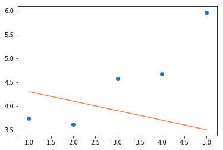
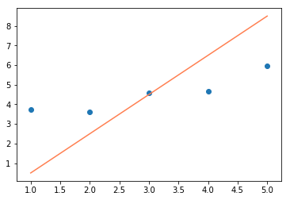
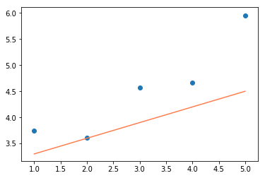

# Exercise 06 - Let's Make Nice Plots

|                       |                           |
| --------------------: | ------------------------- |
|   Turn-in directory : | ex06/                     |
|    Files to turn in : | plot.py                   |
| Forbidden functions : | None                      |
|             Remarks : | Matplotlib is your friend |


**It is plot time!**

For you information, the task we are performing here is called **regression**. It means that we are trying to predict a continuous numerical attribute for all examples (like a price, for instance). Later in the bootcamp, you will see that we can predict other things such as categories.


## Objective:
You must implement a function to plot the data and the prediction line (or regression line).  
You will plot the data points (with their x and y values), and the prediction line that represents your hypothesis ($h_{\theta}$).


## Instructions:
In the plot.py file, create the following function as per the instructions given below:
```python
def plot(x, y, theta):
    """Plot the data and prediction line from three non-empty numpy.ndarray.
    Args:
      x: has to be an numpy.ndarray, a vector of dimension m * 1.
      y: has to be an numpy.ndarray, a vector of dimension m * 1.
      theta: has to be an numpy.ndarray, a vector of dimension 2 * 1.
    Returns:
        Nothing.
    Raises:
      This function should not raise any Exceptions.
    """
    ... Your code ...
```

## Examples:

```python
import numpy as np
x = np.arange(1,6)
y = np.array([3.74013816, 3.61473236, 4.57655287, 4.66793434, 5.95585554]).reshape((-1, 1))

# Example 1:
theta1 = np.array([4.5, -0.2]).reshape((-1, 1))
plot(x, y, theta1)
# Output:
```

{width=400px}

```python
# Example 2:
theta2 = np.array([-1.5, 2]).reshape((-1, 1))
plot(x, y, theta2)
# Output:
```

{width=400px}

\newpage

```python
# Example 3:
theta3 = np.array([3, 0.3]).reshape((-1, 1))
plot(x, y, theta3)
# Output:
```

{width=400px}
