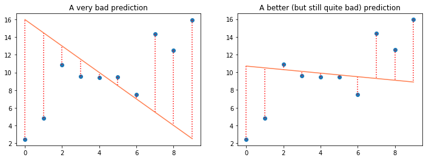

# Interlude - Evaluate

{width=300px}

## Introducing the cost function

How good is our model ?  
It is hard to say just by looking at the plot. We can clearly observe that certain regression lines seem to fit the data better than others, but it would be convenient to find a way to measure it. 

{width=600px}

To evaluate our model, we are going to use a **metric** called **cost function** (sometimes called **loss function**). The cost function tells us how bad our model is, how much it *costs* us to use it, how much information we *lose* when we use it. If the model is good, we won't lose that much, if it's terrible it will cost us a lot!    

The metric you choose will deeply impact the evaluation (and therefore also the training) of your model.   

A frequent way to evaluate the performance of a regression model is to measure the distance between each predicted value ($\hat{y}^{(i)}$) and the real value it tries to predict (${y}^{(i)}$). The distances are then squared, and averaged to get one single metric, denoted $J$:  

$$
J(\theta) = \frac{1}{2m}\sum_{i=1}^{m}(\hat{y}^{(i)} - y^{(i)})^2
$$

The smaller, the better! 

{width=600px}
