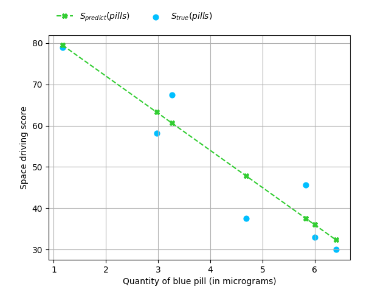
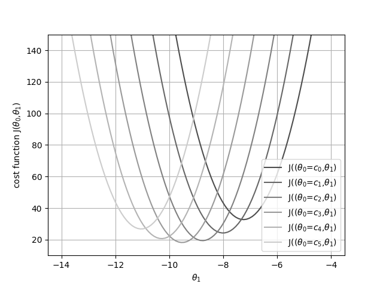

# Exercise 07 - Practicing Linear Regression

|                         |                    |
| -----------------------:| ------------------ |
|   Turn-in directory :   |  ex07              |
|   Files to turn in :    |  linear\_model.py  |
|   Authorized modules :  |  numpy, matplotlib |
|   Forbidden modules :   |  sklearn           |
|   Remarks :             |  Read the doc      |

## Objectives: 
* Evaluate a linear regression model on a very small dataset, with a given hypothesis function $h$.
* Manipulate the cost function $J$, plot it, and briefly analyze the plot.


## Instructions:
You can find in the `resources` folder a tiny dataset called `are_blue_pills_magics.csv` which gives you the driving performance of space pilots as a function of the quantity of the "blue pills" they took before the test. You have a description of the data in the file named `are_blue_pills_magics.txt`.  
As your hypothesis function $h$, you will choose:

$$
h_{\theta}(x) = \theta_0 + \theta_1x
$$

Where $x$ is the variable, and $\theta_0$ and $\theta_1$ are the coefficients of the hypothesis. The hypothesis is a function of $x$.

__You are strongly encouraged to use the vectorized version of the hypothesis.__ Do you remember the linear algebra tricks we are annoying you with? Use it.

You will model the data and plot 2 different graphs:
* A graph with the data and the best hypothesis you find for the spacecraft piloting score versus the quantity of "blue pills" (see example below)

{width=400px}

* The cost function $J(\theta)$ in function of the $\theta$ values (see example below),

{width=400px}

* You will calculate the MSE of the hypothesis you chose (you know how to do it already).

## Examples:
```python
import pandas as pd
import numpy as np
from sklearn.metrics import mean_squared_error
from mylinearregression import MyLinearRegression as MyLR

data = pd.read_csv("are_blue_pills_magics.csv")
Xpill = np.array(data[Micrograms]).reshape(-1,1)
Yscore = np.array(data[Score]).reshape(-1,1)

linear_model1 = MyLR(np.array([[89.0], [-8]]))
linear_model2 = MyLR(np.array([[89.0], [-6]]))
Y_model1 = linear_model1.predict_(Xpill)
Y_model2 = linear_model2.predict_(Xpill)

>>>print(linear_model1.mse_(Xpill, Yscore))
# 57.60304285714282
>>>print(mean_squared_error(Yscore, Y_model1))
# 57.603042857142825
>>>print(linear_model2.mse_(Xpill, Yscore))
# 232.16344285714285
>>>print(mean_squared_error(Yscore, Y_model1))
# 232.16344285714285
```

## Clarification and Hints:
There is no method named `.mse_` in sklearn's LinearRegression class, but there is a method named `.score`. The `.score` method corresponds to the $R^2$ score. The metric MSE is available in the `sklearn.metrics` module.
