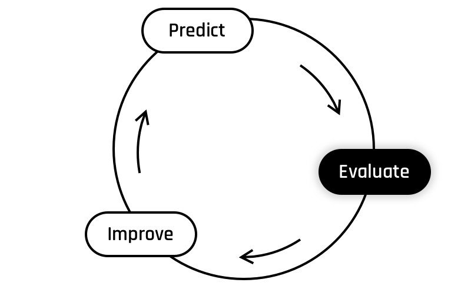
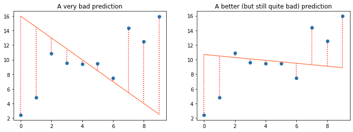

# Interlude - Evaluate

{width=400px}

## Back to the Cost Function

How is our model doing?  

To evaluate our model, remember before we used a **metric** called the **cost function** (also known as **loss function**). The cost function is basically just a measure of how wrong the model is, in all of its predictions.   

Two days ago, we defined the cost function as the average of the squared distances between each prediction and its expected value (distances represented by the dotted lines in the figure below) :   
{width=600px}

The formula was the following: 

$$
J(\theta) = \frac{1}{2m}\sum_{i=1}^{m}(\hat{y}^{(i)} - y^{(i)})^2
$$

And its vectorized form:

$$
\begin{matrix}
J(\theta) = \frac{1}{2m}(\hat{y} - y)\cdot(\hat{y}- y)
\end{matrix}
$$  

#### So, now that we moved to multivariate linear regression, what needs to change?
You may have noticed that variables such as $x_j$ and $\theta_j$ don't intervene in the equation. Indeed, the cost function only uses the predictions ( $\hat{y}$ ) and the expected values ( $y$ ), so the inner workings of the model don't matter to its evaluation metric.  

This means we can use the exact same cost function as we did before! 