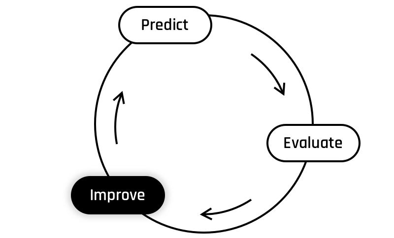

# Interlude - Improve with the Gradient 

{width=400px}  

## Multivariate Gradient

From our multivariate linear hypothesis we can derive our multivariate gradient. It looks a lot like the one we saw yesterday, but instead of having just two components, the gradient now has as many as there are parameters. This means that now we need to calculate $\nabla(J)_0,\nabla(J)_1,\dots,\nabla(J)_n$  

If we take the univariate equations we used yesterday and replace the formula for $\nabla(J)_1$ by a more general $\nabla(J)_j$, we get the following:

$$
\begin{matrix}
\nabla(J)_0 &  = &\frac{1}{m}\sum_{i=1}^{m}(h_{\theta}(x^{(i)}) - y^{(i)}) & \\
\nabla(J)_j & = &\frac{1}{m}\sum_{i=1}^{m}(h_{\theta}(x^{(i)}) - y^{(i)})x_{j}^{(i)} & \text{ for j = 1, ..., n}    
\end{matrix}
$$

Where:  
- $\nabla(J)$ is a vector of size $(n + 1) * 1$, the gradient vector
- $\nabla(J)_j$ is the $j^{th}$ component of $\nabla(J)$, the partial derivative of $J$ with respect to $\theta_j$
- $y$ is a vector of dimension $m * 1$, the vector of expected values
- $y^{(i)}$ is a scalar, the $i^{th}$ component of vector $y$
- $x^{(i)}$ is the feature vector of the $i^{th}$ example
- $x^{(i)}_j$ is a scalar, the $j^{th}$ feature value of the $i^{th}$ example
- $h_{\theta}(x^{(i)})$ is a scalar, the model's estimation of $y^{(i)}$. (It can also be denoted $\hat{y}^{(i)}$)

### Vectorized Form

As usual, we can use some linear algebra magic to get a more compact (and computationally efficient) formula.

First we can use our convention that each training example has an extra $x_0 = 1$ feature, and replace the gradient formulas above by one single equation that is valid for all $j$ components:

$$
\begin{matrix}
\nabla(J)_j & = &\frac{1}{m}\sum_{i=1}^{m}(h_{\theta}(x^{(i)}) - y^{(i)})x_{j}^{(i)} & \text{ for j = 0, ..., n}
\end{matrix}
$$

And this generic equation can then be rewritten in a vectorized form:

$$
\nabla(J) = \frac{1}{m} {X'}^T(X'\theta - y)
$$  

Where:  
- $\nabla(J)$ is the gradient vector of size $(n + 1) * 1$
- $X'$ is a matrix of dimension $m * (n + 1)$, the design matrix onto which a column of $1$'s was added as the first column
- ${X'}^T$ means the matrix has been transposed
- $\theta$ is a vector of size $(n + 1) * 1$, the parameter vector 
- $y$ is a vector of size $m * 1$, the vector of expected values

The vectorized equation can output the entire gradient vector all at once, in one calculation! So if you understand the linear algebra operations, you can forget about the equations we presented at the top of the page and simply use the vectorized one.