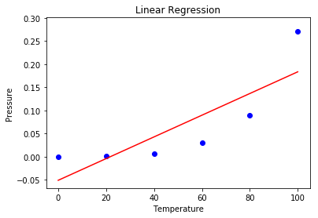

# Interlude - Introducing Polynomial Models

You probably noticed that the method we use is called *linear regression* for a reason: the model generates all of its predictions on a straight line. However, we often encounter features that don't have a linear relationship with the predicted variable, like in the figure below:

{width=300px}

In that case, we are stuck with a straight line that can't fit the data points properly. In this example, what if we could express $y$ not as a function of $x$, but also of $x^2$, and maybe even $x^3$ and $x^4$? We could make a hypothesis that draws a nice **curve** that would better fit the data. That's where polynomial features can help!

## Polynomial features
First we get to do some *feature engineering*. We create new features by raising our initial $x$ feature to the power of 2, and then 3, 4... as far as we want to go. For each new feature we need to create a new column in the dataset.

## Polynomial Hypothesis
Now that we created our new features, we can combine them in a linear hypothesis that looks just the same as what we're used to: 

$$
\hat{y} = \theta_0 + \theta_1 x  +\theta_2 x^{2} + \dots + \theta_n x^{n}
$$  

It's a little strange because we are building a linear combination, not with different features but with different powers of the same feature. This is a first way of introducing non-linearity in a regression model! 

