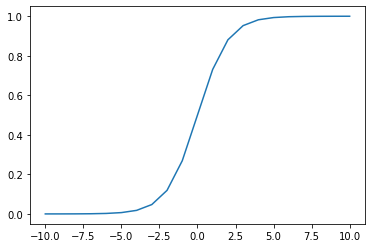

# Interlude - Predict II : Hypothesis 

We hope your curiosity led you to plot your sigmoid function. If you didn't, well here is what it looks like:

{width=300px}  

As you can see, **the sigmoid's output values range from $0$ to $1$**.  
You can input real numbers as big as you want (positive or negative), the output will always land within this range. This will be very helpful for the next part.

# Logistic Hypothesis

Now you've written your sigmoid function, let's look at **the logistic regression hypothesis**.

$$
\begin{matrix}
\hat{y}^{(i)} & = & h_\theta(x^{(i)}) & = & \text{sigmoid}(\theta \cdot x'^{(i)}) 
& =  &\cfrac{1} {1 + e^{-\theta \cdot x'^{(i)}}} & &\text{ for i = 1, \dots, m}    
\end{matrix}
$$

**This is simply the sigmoid function applied on top of the linear regression hypothesis!!**  

It can be vectorized as: 

$$
\begin{matrix}
\hat{y} & = & h_\theta(X) & = & \text{sigmoid}(X'\theta) & =  &\cfrac{1} {1 + e^{-X'\theta}}    
\end{matrix}
$$

As we said before: the **sigmoid function** is just a way to **map the result of a linear equation onto a [0,1] value range**.  

This transformation allows us to interpret the result as a **probability that an individual is a member of a given class**.