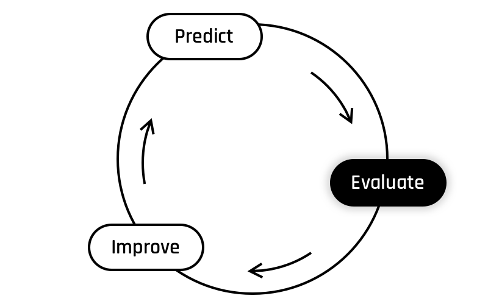
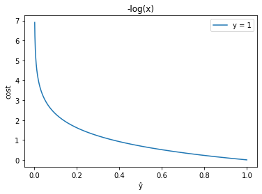
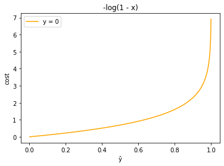
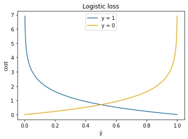

# Interlude - Evaluate

{width=300px}  

Our **model** can **predict the probability** for a given example **to be part of the class labeled as 1**.  
Now it's time to evaluate how good it is.  

The previous cost function, used to evaluate linear regression, is not appropriate in a classification case.  

Given the fact that classification tasks imply only two possible values:
- **zero**, if the element is not a member of the predicted class,
- **one**, if the element is a member of the predicted class, 

measuring the 'distance' between the prediction and the label is not going to be the best way to evaluate the performance of a classification  model. We'll prefer the **logarithmic** function because it can penalize the wrong predictions even more harshly. But let's separate the two possible cases.

## Case 1: The expected output is 1 

In mathematical terms, we write:

$$
y^{(i)} = 1
$$  

Here we need a function that will penalize the classifier with a high cost if its prediction ( $\hat{y}$ ) gets close to $0$. What do you think of this function? (Have a look at its plot)  

$$
cost_1 = -\log(\hat{y})
$$

\newpage

{width=300px}  

You can see from the plot that: 
- if the prediction ( $\hat{y}$ ) is close to $0$, the cost will be great, 
- if the prediction ( $\hat{y}$ ) is close to $1$, the cost will be small.  

So we got our function that can harshly penalize predictions that get close to $0$. But sometimes, $y^{(i)}$ is NOT equal to $1$. What if we *want* $\hat{y}$ to be closer to $0$ instead?

## Case 2: The expected output is 0

In this case we have:
$$
y^{(i)} = 0
$$  

We just need to manipulate the last equation slightly in order to flip the curve the way we need:

$$
cost_0 = -\log(1 - \hat{y}^{(i)})
$$

{width=300px}  

You can see from the plot that: 
- if the prediction is close to $1$, the cost will be great, 
- if the prediction is close to $0$, the cost will be small.  

So this second equation works like the first one, but penalizes the other way: this time $\hat{y}^{(i)}$ gets penalized harder when it gets close to 1.

Now, all we need is a smart way to automatically choose which cost function to use, depending on the value of $y^{(i)}$.

## Putting it all together 

Let's recap. We need a cost function that can alternate between these:

* If $y^{(i)} = 1$

$$
cost = cost_1 = -\log(\hat{y}^{(i)})
$$

* If $y^{(i)} = 0$

$$
cost = cost_0 = -\log(1- \hat{y}^{(i)})
$$

And we can represent it like this:   

{width=300px}  

How do you switch between $cost_0$ and $cost_1$ depending on the value of $y^{(i)}$? We could use an if-else statement in the code, but that's not very pretty and it doesn't provide a cost function that can be expressed as a single mathematical expression. It turns out there is a little mathematical trick we can use to make everything stand in one equation.

## Building the equation for a single training example
For this part let's go step by step. The strategy is to sum both expressions:

$$
cost = cost_1 + cost_0
$$

And then we need some kind of switch to "turn off" the term that shouldnt be use for the example $i$. It turns out we can use the $y^{(i)}$ value itself as a switch! 
- When $y^{(i)} = 0$, we just multiply it with the term we don't want and we'll cancel it out:

$$
\begin{matrix}
cost & = & y^{(i)} \cdot cost_1 + cost_0 \\
cost & = & 0 \cdot cost_1 + cost_0 \\
cost & = & cost_0
\end{matrix}
$$

- When $y^{(i)} = 1$, it's a little trickier. We have to multiply the term we want to cancel out by $(1 - y^{(i)})$

$$
\begin{matrix}
cost & = & cost_1 + (1 - y^{(i)}) \cdot cost_0 \\
cost & = & cost_1 + (1 - 1) \cdot cost_0 \\
cost & = & cost_1 + 0 \cdot cost_0  \\
cost & = & cost_1
\end{matrix}
$$

Now, to make a generic equation that works without knowing in advance the value of $y^{(i)}$, all we need is to sum the two cost functions along with their "switches": 

$$
\begin{matrix}
cost & = & y^{(i)} \cdot cost_1 & + & (1 - y^{(i)}) \cdot cost_0
\end{matrix}
$$
And then, if we develop $cost_0$ and $cost_1$:
$$
\begin{matrix}
cost & = & y^{(i)} \cdot (-\log(\hat{y}^{(i)})) & + & (1 - y^{(i)}) \cdot (-\log(1 - \hat{y}^{(i)}))
\end{matrix}
$$
Finally, if we simplify the sign notation just a bit:
$$
\begin{matrix}
cost & = & -[y^{(i)}\cdot\log(\hat{y}^{(i)}) & + & (1 - y^{(i)})\cdot\log(1 - \hat{y}^{(i)})]
\end{matrix}
$$

## Cross-entropy

We are reaching the goal! All we need to do is and average across all training examples and we end up with our final cost function. It has a name: **cross-entropy**. The equation is the following:  

$$
J( \theta) = -\cfrac{1} {m} \lbrack \sum_{i = 1}^{m} y^{(i)}\log(\hat{y}^{(i)}) + (1 - y^{(i)})\log(1 - \hat{y}^{(i)})\rbrack
$$

This formula allows you to calculate the overall cost of a complete set of predictions. If you have enough, you can stop here and move on to the exercise. If you'd like to better understand how it works and have "automatic switch" process broken down for you, you here we go:

#### If the given example $x^{(i)}$ is not part of the predicted class, $y^{(i)} = 0$ :  

$$
\begin{matrix}
y^{(i)} & = & 0 \\
y^{(i)}\log(\hat{y}^{(i)})) & = & 0   \\
1 - y^{(i)} & = & 1 \\
(1 - y^{(i)})\log(1 - \hat{y}^{(i)}) & = & \log(1 - \hat{y}^{(i)})
\end{matrix}
$$

Therefore 
$$
J( \theta) = -\cfrac{1} {m} \lbrack \sum_{i = 1}^{m} \overbrace{\cancel{y^{(i)}\log(\hat{y}^{(i)})}}^{0} + \overbrace{\cancel{(1 - y^{(i)})}}^{1}\log(1 - \hat{y}^{(i)})\rbrack
$$
$$
J( \theta) = -\cfrac{1} {m} \sum_{i = 1}^{m} \log(1 - \hat{y}^{(i)})
$$
$$
J( \theta) = \cfrac{1} {m} \sum_{i = 1}^{m} -\log(1 - \hat{y}^{(i)})
$$

#### If the given example $x^{(i)}$ is part of the predicted class, $y^{(i)} = 1$ :  

$$
\begin{matrix}
y^{(i)} & = & 1 \\
y^{(i)}\log(\hat{y}^{(i)}) & = & \log(\hat{y}^{(i)})\\
1 - y^{(i)} & = & 0 \\ 
(1 - y^{(i)})\log(1 - \hat{y}^{(i)}) & = & 0  
\end{matrix}
$$
Therefore 
$$
J( \theta) = -\cfrac{1} {m} \lbrack \sum_{i = 1}^{m} \overbrace{\cancel{y^{(i)}}}^{1}\log(\hat{y}^{(i)}) + \overbrace{\cancel{(1 - y^{(i)})\log(1 - \hat{y}^{(i)})}}^{0}\rbrack
$$
$$
J( \theta) = -\cfrac{1} {m} \sum_{i = 1}^{m} \log(\hat{y}^{(i)})
$$
$$
J( \theta) = \cfrac{1} {m} \sum_{i = 1}^{m} -\log(\hat{y}^{(i)})
$$
