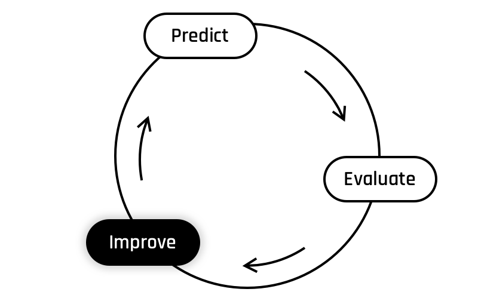

# Improve

{width=300px}  

Now we want to improve the algorithm's performance, or in other words, reduce the cost of its predictions. This brings us (again) to calculating the gradient, which will tells us how much and in what direction we should adjust each of the $\theta$ parameters that belong to the model.

## The logistic gradient 
   
If you remember, to calculate the gradient, we start with the cost function and we derive it with respect to each of the theta parameters. If you know multivariate calculus you can try it for yourself, otherwise we've done it for you: 

$$
\begin{matrix}
\nabla(J)_0 &  = &\cfrac{1}{m}\sum_{i=1}^{m}(h_{\theta}(x^{(i)}) - y^{(i)}) & \\
\nabla(J)_j & = &\cfrac{1}{m}\sum_{i=1}^{m}(h_{\theta}(x^{(i)}) - y^{(i)})x_{j}^{(i)} & \text{ for j = 1, ..., n}    
\end{matrix}
$$

Where:  
- $\nabla(J)$ is a vector of size $(n + 1) * 1$, the gradient vector
- $\nabla(J)_j$ is the $j^{th}$ component of $\nabla(J)$, the partial derivative of $J$ with respect to $\theta_j$
- $y$ is a vector of dimension $m * 1$, the vector of expected values
- $y^{(i)}$ is a scalar, the $i^{th}$ component of vector $y$
- $x^{(i)}$ is the feature vector of the $i^{th}$ example
- $x^{(i)}_j$ is a scalar, the $j^{th}$ feature value of the $i^{th}$ example
- $h_{\theta}(x^{(i)})$ is a scalar, the model's estimation of $y^{(i)}$

This formula should be very familiar to you, as it's the same as the linear regression gradient!  
The only difference is that $h_{\theta}(x^{(i)})$ corresponds to **the logistic regression hypothesis instead of the linear regression hypothesis**.  

In other words:

$$
h_{\theta}(x^{(i)}) = \text{sigmoid}( \theta \cdot x'^{(i)}) = \cfrac{1} {1 + e^{-\theta \cdot x'^{(i)}}}
$$   

Instead of:   

$$
\cancel{h_{\theta}(x^{(i)}) = \theta \cdot x'^{(i)}}
$$  