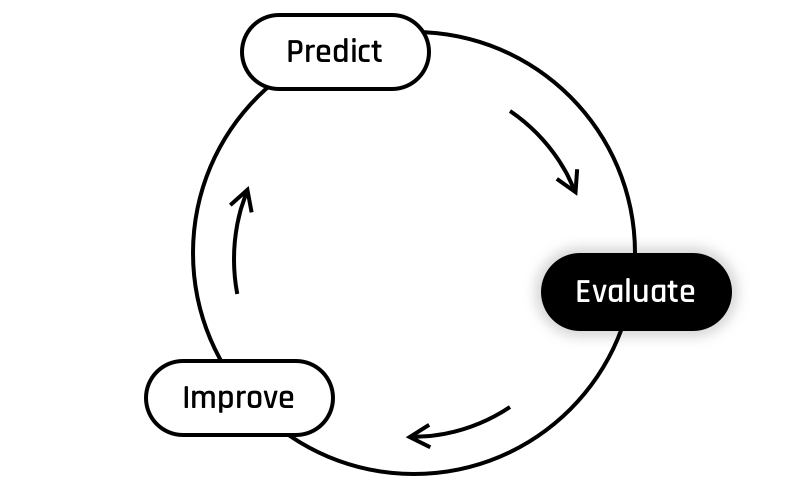

# Interlude - Fighting Overfitting... With Regularization

{width=300px}  

In the **module07**, we talked about the problem of **overfitting** and the necessity of splitting the dataset into a **training set** and a **test set** in order to spot it.  

However, being able to detect overfitting does not mean being able to avoid it.  

To address this important issue, it is time to introduce you to a new technique: **regularization**.

If you remember well, overfitting happens because the model takes advantage of irrelevant signals in the training data. The basic idea behind regularization is to **penalize the model for putting too much weight on certain** (usually heavy polynomial) **features**. We do this by adding an extra term in the cost function:  

$$
\text{regularized cost function} = \text{cost function} + \frac{\lambda}{2m} \sum_{j = 1}^n \theta_j^2
$$

By doing so, **we are encouraging the model to keep its** $\theta$ **values as small as possible**. Indeed, the values of $\theta$ *themselves* are now taken into account when calculating the cost.

$\lambda$ (called *lambda*) is the parameter through which you can modulate how reglarization should impact the model's construction.  
- If $\lambda = 0$, there is no regularization (as we did until now),
- If $\lambda$ is very large, it will drive all the $\theta$ parameters to $0$.

**Please notice:** in the regularization term, the sum starts at $j = 1$ because we do NOT want to penalize the value of $\theta_0$ (the y-intercept, which doesn't depend on a feature).

## Be carefull!  
Machine Learning was essentially developed by computer scientists (not mathematicians). This can cause problems when we try to represent things mathematically.  
For example: using the $\theta_0$ notation to represent the y-intercept makes things easy when we apply the linear algebra trick, **but** it completly messes up the overall matrix notation!  

According to that notation, the $X'$ matrix  has the following properties: 
* its rows, $x'^{(i)}$, follow the mathematical indexing: starting at 1.
* its columns, $x'_j$, follow the computer science indexing: starting at 0. 

$$
X' =
\underbrace{
\begin{bmatrix}
1 & x_1^{(1)} & \dots & x_n^{(1)} \\
\vdots & \vdots & \ddots & \vdots \\ 
1 & x_1^{(m)} & \dots & x_n^{(m)} \\ 
\end{bmatrix}  
}_{\begin{matrix}
    j = 0, \dots, n
\end{matrix}}
=     
\left .
\begin{bmatrix}
x_0^{(1)} & x_1^{(1)} & \dots & x_n^{(1)} \\
\vdots & \vdots & \ddots & \vdots \\ 
x_0^{(m)} & x_1^{(m)} & \dots & x_n^{(m)} \\ 
\end{bmatrix}
\right \} i = 1, \dots, m
$$

It's precisely for this reason that you keep seeing that $X'$ is of dimensions $m \times (n+1)$

## Terminology:
The regularization technique we are introducing here is named **$L_2 \text{ regularization}$**, because it adds the squared $L_2 \text{ norm}$ of the $\theta$ vector to the cost function.  
The $L_2 \text{ norm}$ of a given vector $x$, written

$$
L_2(x) = ||x||_2 = \sqrt{\sum_i x_i^2 } \\
L_2(x)^2 = ||x||_2^2 = \sum_i x_i^2  \\
$$

is its **euclidean norm** (i.e. the sum of the components squared).  

There is an infinite variety of norms that could be used as regularization terms, depending on the desired regularization effect. Here, we will only use $L_2$, the most common one.

**Note:**

$$
\text{the notation }\sum_i \\ \text{ means: "the sum for all } i"
$$

There is no need to give explicitly the start and the end of the summation index if we want to sum over all the values of $i$.  
However, it is better to do it anyway because it forces us to be sure of what we are doing. And in our case, we do not want to sum over $\theta_0$...

## Our old friend vectorization ...

It is not a surprise, we can use vectorization to calculate $\sum_{j = 1}^n \theta_j^2$  more efficiently. It could be a good exercise for you to try to figure it out by yourself. We suggest you give it a try and then check the answer on the next page.
